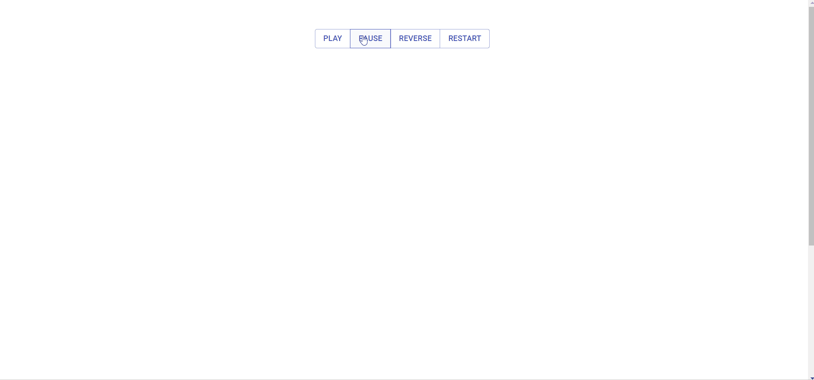

This repo contains a series of samples of UI components using ReactJS and GSAP animations.

### 1. Fade in/out cards

Use GSAP timeline states - play, pause, reverse, restart, to control fade animations of a set of cards.

